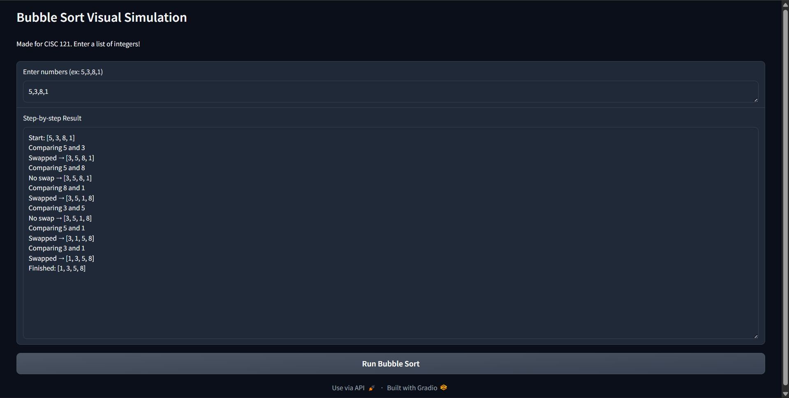
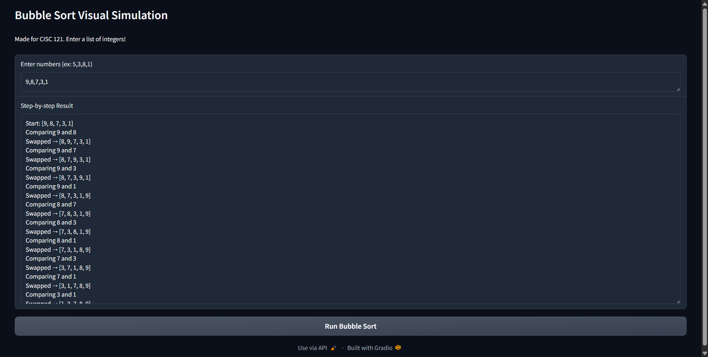

# Bubble Sort Visual Simulation (CISC 121 Project)

This is a small Python app that visually simulates **Bubble Sort** using **Gradio**.  
The user types a list of integers, and the app shows each comparison and swap step-by-step.

---

## Demo Screenshots

### TEST 1

### TEST 2

---

## 1. Problem Breakdown & Computational Thinking

### 1.1 Decomposition

I broke the project down into these small parts:

- **Input handling**  
  - Read a string from the Gradio textbox (ex: `"5,3,8,1"`).  
  - seperate the numbers by commas and convert each piece into an `int`.

- **Bubble sort logic**  
  - Use two loops.  
  - Compare the neighbouring elements `arr[j]` and `arr[j+1]`.  
  - Swap if they are in the wrong order, keep if not.

- **Recording steps**  
  - Keep a `steps` list of strings.  
  - Add messages like `"Comparing 5 and 3"`, `"Swapped → [3, 5, 8, 1]"`, etc.  
  - At the end, combine all steps into one big string.

- **User interface (Gradio)**  
  - One textbox for input numbers.  
  - One textbox for all the steps.  
  - One button that runs `bubble_sort_steps(...)` when clicked.

### 1.2 Pattern Recognition

Some patterns I noticed in Bubble Sort:

- On every pass of the outer loop, the largest remaining value moves to the right.
- I always compare neighbouring elements (`j` and `j+1`).
- The inner loop gets shorter each pass (`n - i - 1`) because the last part of the list is already sorted.
- The same compare → maybe swap → move on pattern repeats until the list is sorted.

### 1.3 Abstraction

- I only show:
  - The current array
  - the two numbers are being compared
  - Whether they were swapped or not
- I hide unnecessary details like:
  - Exact values of `i` and `j`
  - How Python manages memory or the call stack
- The UI just asks for:
  - A list of integers seperated by commas 
  
### 1.4 Algorithm Design

1. **User input**: get a string from the textbox (ex: `"5,3,8,1"`).
2. **Parse input**: split by `","` and try to convert to integers.
   - If this fails, return an error message.
3. **Initialize**:
   - Save the starting array in `steps` as `"Start: [ ... ]"`.
4. **Bubble Sort loops**:
   - For each `i` from `0` to `n-1`:
     - For each `j` from `0` to `n-i-2`:
       - Record `"Comparing a and b"`.
       - If `arr[j] > arr[j+1]`:
         - Swap the two values.
         - Record `"Swapped → [new array]"`.
       - Else:
         - Record `"No swap → [array]"`.
5. **Finish**:
   - Record `"Finished: [sorted array]"`.
   - Combine all strings in `steps` with newlines and return that string.
6. **Gradio**:
   - Show the result string in a multiline textbox.

---

## 2. Flowchart

# How to Run the App (Locally)

1. Install required packages:
  
2. Run the program:

3. Gradio will open a local link in your browser.

   
# Hugging Face Deployment
My app is also deployed online as a Hugging Face Space:

https://huggingface.co/spaces/RamezMina/cisc121-bubble-sort

---

# Testing & Verification

I tested the app with several cases:

- **Already sorted list:** `1,2,3,4`  
- **Reverse sorted list:** `9,8,7,6`  
- **Random list**  
- **Duplicates:** `5,5,2,9`  
- **Invalid input:** letters or symbols → correctly shows an error message  

Screenshots of two tests are included above.

---

# Author & Acknowledgment

Created by **Ramez Mina**, Queen’s University (CISC 121).  
AI tools (ChatGPT) were used only for Level-4 assistance: debugging help, formatting, and wording suggestions.  
The logic, code, and design decisions were written by me.
